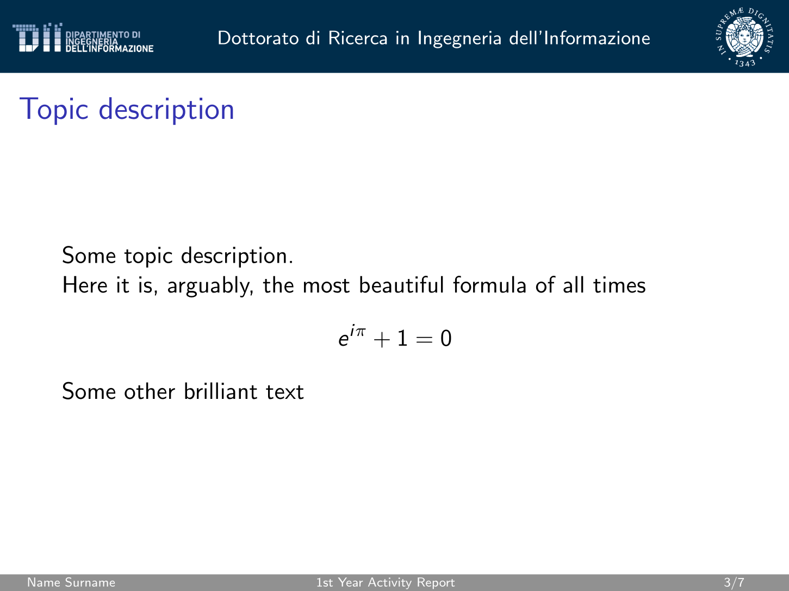

# dii-presentation-latex

Beamer theme for the Department of Information Engineering(Dipartimento di Ingegneria dell'Informazione or DII) of the University of Pisa.




## Usage

Clone the repository

```
git clone https://github.com/galatolofederico/dii-presentation-latex.git
```

Copy the `diipresentation` folder in your project and include the theme with:

```
\usepackage{diipresentation/beamertheme}
```

## Example

This repository provides some example slides in the file `slides.tex`. 

You can check out the example PDF [here](./slides.pdf)

## Build

This repository also provides a basic `Makefile`. 

To build the example PDF yourself:

```
make
```

To clean up the auxiliary files:

```
make clean
```